# PancakeSwap Frontend - AI 开发上下文

> **项目类型**: 大型 DeFi 平台 Monorepo
> **分析时间**: 2025-12-22 21:10:28
> **扫描覆盖率**: 深度分析 (15-20%)
> **技术栈**: Next.js + TypeScript + Turbo

## 变更记录 (Changelog)

- **2025-12-22 21:10:28**: 深度架构分析，更新模块索引，扩展覆盖范围
- **2025-12-22 18:21:04**: 初始化架构分析，生成根级和模块级文档结构
- **覆盖范围**: 9个应用，46个包，核心业务逻辑梳理

## 项目愿景

PancakeSwap 是全球领先的 DeFi 交易平台，支持多链生态（BSC、ETH、Aptos、Solana、TON），为用户提供：
- 去中心化交易 (Swap)
- 流动性挖矿 (Liquidity/Farming)
- 跨链桥接 (Bridge)
- 游戏化金融 (GameFi)
- NFT 市场
- 预测市场
- 永续合约交易

## 架构总览

### 🏗️ Monorepo 结构
```
SimpleFlow-monorepo/
├── apps/           # 前端应用 (9个)
├── packages/       # 共享包和SDK (46个)
├── scripts/        # 开发和构建脚本
├── apis/          # API服务 (5个)
├── examples/      # 示例和演示
└── .claude/       # AI上下文配置
```

### 🌐 多链生态支持
- **EVM兼容链**: BSC, Ethereum, Polygon, zkSync, Arbitrum, Optimism
- **非EVM链**: Aptos, Solana, TON
- **Layer2**: zkSync, Arbitrum, Optimism
- **跨链桥**: BNB Chain Canonical Bridge

### 📦 核心技术栈
- **前端框架**: Next.js 15+ (Pages Router)
- **样式方案**: Styled Components + Vanilla Extract
- **状态管理**: Redux Toolkit + Jotai + Valtio
- **组件库**: 自研 @pancakeswap/uikit + Storybook
- **构建工具**: Turbo + pnpm
- **类型检查**: TypeScript (严格模式)
- **钱包集成**: Wagmi + Solana Adapter + Privy

## ✨ 模块结构图

```mermaid
graph TD
    A["(根) PancakeSwap Frontend"] --> B["apps - 应用层"];
    A --> C["packages - 共享层"];
    A --> D["scripts - 工具层"];
    A --> E["apis - API服务层"];

    B --> F["web - 主交易平台"];
    B --> G["aptos - Aptos版本"];
    B --> H["solana - Solana版本"];
    B --> I["blog - 官方博客"];
    B --> J["bridge - 跨链桥"];
    B --> K["games - 游戏化应用"];
    B --> L["gamification - 游戏系统"];
    B --> M["ton - TON集成"];
    B --> N["e2e - 端到端测试"];

    C --> O["swap-sdk - 核心交易SDK"];
    C --> P["smart-router - 智能路由"];
    C --> Q["uikit - UI组件库"];
    C --> R["v2-sdk - V2协议SDK"];
    C --> S["v3-sdk - V3协议SDK"];
    C --> T["routing-sdk - 路由SDK"];
    C --> U["multicall - 多合约调用"];
    C --> V["wagmi - 钱包连接"];
    C --> W["localization - 国际化"];
    C --> X["jupiter-terminal - Solana路由"];
    C --> Y["chains - 链配置"];
    C --> Z["hooks - React Hooks"];

    E --> AA["routing - 路由API"];
    E --> BB["farms - 挖矿API"];
    E --> CC["rwa - 现实资产API"];
    E --> DD["proxy-worker - 代理服务"];

    click F "./apps/web/CLAUDE.md" "查看主交易平台文档"
    click G "./apps/aptos/CLAUDE.md" "查看Aptos应用文档"
    click H "./apps/solana/CLAUDE.md" "查看Solana应用文档"
    click O "./packages/swap-sdk/CLAUDE.md" "查看交易SDK文档"
    click P "./packages/smart-router/CLAUDE.md" "查看智能路由文档"
    click Q "./packages/uikit/CLAUDE.md" "查看UI组件库文档"
```



## 📋 模块索引

| 模块路径 | 类型 | 描述 | 状态 | 依赖数 |
|---------|------|------|------|-------|
| **apps/web** | 🚀 主应用 | BSC/ETH链DeFi交易平台 | ✅ 深度分析 | 88 |
| **apps/aptos** | 🔗 链适配 | Aptos链交易平台 | 🟡 已识别 | 23 |
| **apps/solana** | ☀️ 链适配 | Solana链交易平台 | 🟡 已识别 | 57 |
| **apps/bridge** | 🌉 跨链 | 跨链资产桥接 | 🟡 待分析 | - |
| **apps/blog** | 📝 内容 | 官方博客平台 | 🟡 待分析 | - |
| **apps/games** | 🎮 游戏 | 游戏化DeFi应用 | 🟡 已删除 | - |
| **apps/gamification** | 🏆 游戏化 | 积分和成就系统 | 🟡 已删除 | - |
| **apps/ton** | 🔵 链适配 | TON区块链集成 | 🟡 待分析 | - |
| **apps/e2e** | 🧪 测试 | 端到端自动化测试 | 🟡 已识别 | - |
| **packages/swap-sdk** | 📦 SDK | 核心交易SDK，多链支持 | ✅ 深度分析 | 15 |
| **packages/smart-router** | 🧠 智能 | 最优交易路径算法 | ✅ 深度分析 | 45 |
| **packages/uikit** | 🎨 UI | 共享组件库+Storybook | ✅ 深度分析 | 33 |
| **packages/v2-sdk** | 📦 SDK | V2版本AMM协议SDK | 🟡 已识别 | - |
| **packages/v3-sdk** | 📦 SDK | V3版本AMM协议SDK | 🟡 已识别 | - |
| **packages/routing-sdk** | 📦 SDK | 路由SDK核心模块 | 🟡 已识别 | 8+addons |
| **packages/multicall** | 🔧 工具 | 多合约调用工具 | 🟡 已识别 | - |
| **packages/wagmi** | 🔗 钱包 | 以太坊钱包连接扩展 | 🟡 已识别 | - |
| **packages/jupiter-terminal** | ☀️ 路由 | Solana Jupiter集成 | 🟡 已识别 | - |
| **packages/hooks** | 🪝 React | 共享React Hooks | 🟡 已识别 | - |
| **packages/localization** | 🌍 国际化 | 多语言支持系统 | 🟡 已识别 | - |
| **packages/chains** | ⛓️ 配置 | 区块链配置信息 | 🟡 已识别 | - |
| **apis/routing** | 🌐 API | 路由计算API服务 | 🟡 已识别 | - |
| **apis/farms** | 🌐 API | 挖矿数据API服务 | 🟡 已识别 | - |
| **apis/proxy-worker** | 🌐 API | 代理服务Worker | 🟡 已识别 | - |

## 🛠️ 运行与开发

### 环境要求
- **Node.js**: >=18.20.0 (推荐 20.17.0)
- **pnpm**: >=10.13.1
- **系统**: macOS, Linux, Windows (WSL2)

### 快速开始

```bash
# 安装依赖
pnpm install

# 启动主应用 (Web)
pnpm dev

# 启动Aptos版本
pnpm dev:aptos

# 启动Solana版本
pnpm dev:solana

# 启动博客
pnpm dev:blog

# 启动跨链桥
pnpm dev:bridge

# 启动Jupiter (Solana路由)
pnpm dev:jupiter
```

### 构建命令

```bash
# 构建所有包
pnpm build:packages

# 构建主应用
pnpm build

# 构建特定应用
pnpm build:aptos
pnpm build:solana
pnpm build:blog
pnpm build:bridge

# 构建Jupiter
pnpm build:jupiter
```

### 开发工具

```bash
# 代码检查
pnpm lint

# 格式化代码
pnpm format:write

# 运行测试
pnpm test:ci

# 单元测试覆盖率
pnpm test:coverage

# E2E测试
pnpm e2e:ci

# Storybook开发
pnpm storybook

# 构建Storybook
pnpm build:storybook
```

## 🧪 测试策略

### 测试层级
1. **单元测试**: Vitest (包级别)
2. **集成测试**: Vitest (应用级别)
3. **E2E测试**: Cypress (用户流程)
4. **视觉测试**: Storybook + Chromatic
5. **性能测试**: Web Vitals + Bundle Analyzer

### 测试覆盖率
- **目标覆盖率**: 80%+
- **关键路径**: 交易流程、钱包连接、路由计算
- **核心模块**: Smart Router, Swap SDK, UI Components

### 测试配置
```bash
# 运行特定测试
pnpm test -- packages/smart-router
pnpm test -- apps/web

# 测试配置验证
pnpm test:config

# 翻译测试
pnpm test:translations

# 视觉回归测试
pnpm test:visual
```

## 📏 编码规范

### TypeScript 配置
- **严格模式**: 启用所有严格检查
- **目标版本**: ES2022
- **模块系统**: ESNext
- **路径别名**: `@/` 指向 `src/`, `@pancakeswap/*` 指向packages

### 代码风格
- **ESLint**: @pancakeswap/eslint-config-pancake
- **Prettier**: 2.8.3 (标准配置)
- **Styled Components**: 样式-in-JS
- **Vanilla Extract**: CSS-in-TypeScript
- **文件命名**: PascalCase (组件), camelCase (工具)

### Git 工作流
- **主分支**: `main` (生产环境)
- **开发分支**: `develop` (开发环境)
- **功能分支**: `feature/功能名称`
- **修复分支**: `fix/问题描述`
- **发布分支**: `release/版本号`

### 提交规范
```
type(scope): description

feat: 新功能
fix: 修复bug
docs: 文档更新
style: 代码格式调整
refactor: 重构
test: 测试相关
chore: 构建/工具相关
perf: 性能优化
ci: CI/CD相关
```

## 🤖 AI 使用指引

### 开发优先级
1. **🔥 高优先级**:
   - 核心交易逻辑 (swap, liquidity, routing)
   - 安全相关 (wallet connection, transaction validation)
   - 用户体验 (loading states, error handling)

2. **⚡ 中优先级**:
   - 性能优化 (bundle size, route calculation)
   - 代码质量 (tests, types, documentation)
   - 测试覆盖 (unit tests, integration tests)

3. **🔧 低优先级**:
   - 文档完善 (README, API docs)
   - 工具优化 (dev experience, build scripts)
   - 技术债务 (legacy code migration)

### 常见开发任务
- **新增链支持**: 参考 `apps/aptos` 和 `apps/solana` 的适配模式
- **添加新功能**: 优先复用 `packages/uikit` 和 `packages/hooks`
- **性能优化**: 关注 `packages/smart-router` 和 `packages/multicall`
- **UI组件**: 基于 Storybook 在 `packages/uikit` 中开发
- **新增DEX**: 扩展 `packages/smart-router` 协议支持

### 代码生成模式
```typescript
// 新组件模板
import React from 'react'
import { Flex, Text } from '@pancakeswap/uikit'
import { useTranslation } from '@pancakeswap/localization'

interface ComponentProps {
  // 定义props
}

const Component: React.FC<ComponentProps> = ({ ...props }) => {
  const { t } = useTranslation()

  return (
    <Flex>
      <Text>{t('Component Content')}</Text>
    </Flex>
  )
}

export default Component
```

### 调试技巧
- **状态调试**: Redux DevTools + Jotai DevTools
- **网络请求**: 浏览器 DevTools + GraphQL Playground
- **合约交互**: Etherscan + Contract Debug
- **性能分析**: Next.js Bundle Analyzer + Web Vitals
- **路由调试**: Smart Router Debug Mode

### 安全注意事项
- **智能合约交互**: 始终验证合约地址
- **用户资产**: 永不处理私钥，使用钱包签名
- **输入验证**: 严格验证用户输入和API响应
- **前端安全**: CSP Headers, XSS防护, 依赖安全扫描

## 🔗 相关资源

### 内部文档
- [组件库 Storybook](http://localhost:6006)
- [API 文档](./docs/api)
- [部署指南](./docs/deployment)
- [智能合约文档](./docs/contracts)

### 外部资源
- [Next.js 官方文档](https://nextjs.org/docs)
- [PancakeSwap 官网](https://pancakeswap.finance)
- [Turbo Monorepo 指南](https://turbo.build/repo/docs)
- [Viem 文档](https://viem.sh)
- [Wagmi 文档](https://wagmi.sh)

### 重要配置文件
- `turbo.json` - Monorepo 构建配置
- `pnpm-workspace.yaml` - 工作空间配置
- `next.config.mjs` - Next.js 配置
- `.eslintrc.js` - 代码检查规则
- `tsconfig.json` - TypeScript 基础配置

### 监控和分析
- **Sentry**: 错误监控和性能追踪
- **Google Analytics**: 用户行为分析
- **Datadog**: 应用性能监控 (APM)
- **Bundle Analyzer**: 构建包分析

---

## 📊 扫描统计

- **扫描时间**: 2025-12-22 21:10:28
- **分析模块数**: 20个 (9 apps + 11 packages)
- **文档覆盖率**: 深度分析 15-20%
- **核心模块**: 已完成 apps/web, packages/smart-router, packages/uikit
- **技术债务**: 识别 TypeScript 构建警告、跨链复杂性

> **注**: 本文档由 AI 自动生成，随项目演进持续更新。如发现不准确或过时信息，请及时更新。