# Pancake Frontend - AI 上下文文档

> 本文档由 AI 架构师自动生成，最后更新时间：2025-12-24 19:19:46

## 变更记录 (Changelog)

| 日期 | 操作 | 说明 |
|------|------|------|
| 2025-12-24 19:19:46 | 初始化 | 首次创建 AI 上下文文档，生成根级和模块级文档 |

---

## 项目愿景

Pancake Frontend 是一个基于 pnpm workspace 的 monorepo 项目，为 PancakeSwap 去中心化交易所提供完整的前端解决方案。项目支持多链（EVM、Aptos、Solana 等）的 DEX 功能，包括代币交换、流动性提供、农场质押、IFO（初始农场发行）等核心 DeFi 功能。

主要特点：
- **多链支持**：EVM 链（BSC、Ethernet、Polygon 等）、Aptos、Solana
- **模块化架构**：采用 monorepo 管理，apps 和 packages 分离
- **统一 SDK**：提供 swap-sdk、v3-sdk、smart-router 等核心 SDK
- **多应用**：包含 web（主应用）、aptos、solana、gamification、games 等独立应用

---

## 架构总览

### 技术栈

- **构建工具**：Turbo (monorepo 构建系统)
- **包管理器**：pnpm 10.13.1
- **框架**：Next.js 15.5.9
- **语言**：TypeScript 5.7.3
- **状态管理**：Redux Toolkit + Jotai
- **样式**：styled-components 6.0.7 + vanilla-extract
- **测试**：Vitest
- **区块链交互**：wagmi 2.17.5, viem 2.37.13
- **钱包连接**：WalletConnect, Privy, Blocto 等

### 项目结构

```
SimpleFlow-monorepo/
├── apps/                    # 应用程序（前端应用）
│   ├── web/                # 主 Web 应用（EVM 多链）
│   ├── aptos/              # Aptos 链专用应用
│   ├── solana/             # Solana 链专用应用
│   ├── gamification/       # 游戏化应用
│   ├── games/              # 游戏中心
│   ├── bridge/             # 跨链桥应用
│   ├── ton/                # TON 链应用
│   ├── blog/               # 博客应用
│   └── e2e/                # E2E 测试应用
├── packages/               # 共享包
│   ├── swap-sdk-evm/       # EVM 链 Swap SDK
│   ├── v3-sdk/             # V3 协议 SDK
│   ├── v2-sdk/             # V2 协议 SDK
│   ├── smart-router/       # 智能路由 SDK
│   ├── routing-sdk/        # 路由计算 SDK
│   ├── aptos-swap-sdk/     # Aptos Swap SDK
│   ├── solana-*            # Solana 相关 SDK
│   ├── chains/             # 链配置（单一数据源）
│   ├── tokens/             # 代币配置
│   ├── farms/              # 农场逻辑
│   ├── pools/              # 池子逻辑
│   ├── uikit/              # UI 组件库
│   ├── hooks/              # 共享 React Hooks
│   ├── localization/       # 国际化
│   ├── wagmi/              # wagmi 扩展
│   └── ...                 # 其他共享包
├── apis/                   # API 服务（Cloudflare Workers）
│   ├── routing/            # 路由计算 API
│   ├── farms/              # 农场数据 API
│   ├── proxy-worker/       # 代理服务
│   └── rwa/                # RWA 相关 API
├── scripts/                # 构建和工具脚本
└── docs/                   # 项目文档

```

---

## 模块结构图

```mermaid
graph TD
    ROOT["(根) SimpleFlow-monorepo"]

    ROOT --> APPS["apps/"]
    ROOT --> PACKAGES["packages/"]
    ROOT --> APIS["apis/"]
    ROOT --> SCRIPTS["scripts/"]

    APPS --> WEB["web - 主 Web 应用"]
    APPS --> APTOS["aptos - Aptos 应用"]
    APPS --> SOLANA["solana - Solana 应用"]
    APPS --> GAMIFICATION["gamification - 游戏化"]
    APPS --> GAMES["games - 游戏中心"]
    APPS --> BRIDGE["bridge - 跨链桥"]
    APPS --> BLOG["blog - 博客"]
    APPS --> E2E["e2e - E2E 测试"]

    PACKAGES --> SDK_CORE["swap-sdk-core - 核心 SDK"]
    PACKAGES --> SDK_EVM["swap-sdk-evm - EVM SDK"]
    PACKAGES --> V3_SDK["v3-sdk - V3 SDK"]
    PACKAGES --> V2_SDK["v2-sdk - V2 SDK"]
    PACKAGES --> SMART_ROUTER["smart-router - 智能路由"]
    PACKAGES --> ROUTING_SDK["routing-sdk - 路由 SDK"]
    PACKAGES --> FARMS["farms - 农场逻辑"]
    PACKAGES --> POOLS["pools - 池子逻辑"]
    PACKAGES --> CHAINS["chains - 链配置"]
    PACKAGES --> TOKENS["tokens - 代币配置"]
    PACKAGES --> UIKIT["uikit - UI 组件库"]
    PACKAGES --> HOOKS["hooks - 共享 Hooks"]
    PACKAGES --> LOCALIZATION["localization - 国际化"]
    PACKAGES --> WAGMI["wagmi - wagmi 扩展"]
    PACKAGES --> MULTICALL["multicall - 多链调用"]

    APIS --> ROUTING_API["routing - 路由 API"]
    APIS --> FARMS_API["farms - 农场 API"]
    APIS --> PROXY["proxy-worker - 代理"]
    APIS --> RWA["rwa - RWA API"]

    click WEB "./apps/web/CLAUDE.md" "查看 web 应用文档"
    click APTOS "./apps/aptos/CLAUDE.md" "查看 aptos 应用文档"
    click SOLANA "./apps/solana/CLAUDE.md" "查看 solana 应用文档"
    click GAMIFICATION "./apps/gamification/CLAUDE.md" "查看 gamification 应用文档"
    click GAMES "./apps/games/CLAUDE.md" "查看 games 应用文档"

    click SMART_ROUTER "./packages/smart-router/CLAUDE.md" "查看 smart-router 文档"
    click V3_SDK "./packages/v3-sdk/CLAUDE.md" "查看 v3-sdk 文档"
    click FARMS "./packages/farms/CLAUDE.md" "查看 farms 文档"
    click CHAINS "./packages/chains/CLAUDE.md" "查看 chains 文档"
    click UIKIT "./packages/uikit/CLAUDE.md" "查看 uikit 文档"
```



---

## 模块索引

| 模块路径 | 类型 | 语言 | 职责描述 | 文档链接 |
|---------|------|------|---------|---------|
| `apps/web` | 应用 | TypeScript | 主 Web 应用，支持 EVM 多链 DEX 功能 | [CLAUDE.md](./apps/web/CLAUDE.md) |
| `apps/aptos` | 应用 | TypeScript | Aptos 链专用 DEX 应用 | [CLAUDE.md](./apps/aptos/CLAUDE.md) |
| `apps/solana` | 应用 | TypeScript | Solana 链专用 DEX 应用（Jupiter 集成） | [CLAUDE.md](./apps/solana/CLAUDE.md) |
| `apps/gamification` | 应用 | TypeScript | 游戏化和任务系统 | [CLAUDE.md](./apps/gamification/CLAUDE.md) |
| `apps/games` | 应用 | TypeScript | 游戏中心平台 | [CLAUDE.md](./apps/games/CLAUDE.md) |
| `apps/bridge` | 应用 | TypeScript | 跨链桥应用（LayerZero） | [CLAUDE.md](./apps/bridge/CLAUDE.md) |
| `apps/blog` | 应用 | TypeScript | PancakeSwap 博客 | - |
| `apps/e2e` | 测试 | TypeScript | Cypress E2E 测试 | - |
| `packages/swap-sdk-evm` | SDK | TypeScript | EVM 链 Swap SDK，包含 V2/V3 交易逻辑 | [CLAUDE.md](./packages/swap-sdk-evm/CLAUDE.md) |
| `packages/v3-sdk` | SDK | TypeScript | V3 协议 SDK，池子、头寸、路由计算 | [CLAUDE.md](./packages/v3-sdk/CLAUDE.md) |
| `packages/v2-sdk` | SDK | TypeScript | V2 协议 SDK，配对、路由、交易 | - |
| `packages/smart-router` | SDK | TypeScript | 智能路由，自动寻找最优交易路径 | [CLAUDE.md](./packages/smart-router/CLAUDE.md) |
| `packages/routing-sdk` | SDK | TypeScript | 路由计算核心 SDK | - |
| `packages/aptos-swap-sdk` | SDK | TypeScript | Aptos Swap SDK | - |
| `packages/solana-*` | SDK | TypeScript | Solana SDK 系列（core, clmm, router） | - |
| `packages/chains` | 配置 | TypeScript | 链配置单一数据源（chainId, RPC, 子图等） | [CLAUDE.md](./packages/chains/CLAUDE.md) |
| `packages/tokens` | 配置 | TypeScript | 代币配置和列表 | - |
| `packages/farms` | 逻辑 | TypeScript | 农场数据获取和计算逻辑 | [CLAUDE.md](./packages/farms/CLAUDE.md) |
| `packages/pools` | 逻辑 | TypeScript | 池子数据获取 | - |
| `packages/uikit` | UI | TypeScript | UI 组件库（Storybook） | [CLAUDE.md](./packages/uikit/CLAUDE.md) |
| `packages/hooks` | 逻辑 | TypeScript | 共享 React Hooks | - |
| `packages/localization` | 国际化 | TypeScript | i18n 国际化支持 | - |
| `packages/wagmi` | SDK | TypeScript | wagmi 扩展（BSC 链、币安钱包） | - |
| `packages/multicall` | SDK | TypeScript | 多链调用优化 SDK | - |
| `packages/permit2-sdk` | SDK | TypeScript | Permit2 签名授权 | - |
| `packages/universal-router-sdk` | SDK | TypeScript | 通用路由 SDK | - |
| `packages/utils` | 工具 | TypeScript | 通用工具函数 | - |
| `apis/routing` | API | TypeScript | 路由计算 Cloudflare Workers API | [CLAUDE.md](./apis/routing/CLAUDE.md) |
| `apis/farms` | API | TypeScript | 农场数据 Cloudflare Workers API | [CLAUDE.md](./apis/farms/CLAUDE.md) |
| `apis/proxy-worker` | API | TypeScript | 代理服务 | - |
| `apis/rwa` | API | TypeScript | RWA 相关 API | - |
| `scripts` | 工具 | TypeScript | 构建、APR 更新等脚本 | - |

---

## 运行与开发

### 环境要求

- Node.js >= 18.20.0（推荐 20.17.0）
- pnpm 10.13.1（通过 Volta 管理）

### 安装依赖

```bash
pnpm install
```

### 开发模式

```bash
# 主 Web 应用
pnpm dev

# Aptos 应用
pnpm dev:aptos

# Solana 应用
pnpm dev:solana

# 游戏化应用
pnpm dev:gamification

# 游戏中心
pnpm dev:games

# 博客
pnpm dev:blog

# 跨链桥
pnpm dev:bridge
```

### 构建

```bash
# 构建主应用
pnpm build

# 构建所有包
pnpm build:packages

# 构建特定应用
pnpm build:web
pnpm build:aptos
pnpm build:solana
```

### 测试

```bash
# 运行测试
pnpm test

# E2E 测试
pnpm e2e:ci

# 配置测试
pnpm test:config

# 翻译测试
pnpm test:translations
```

### 代码质量

```bash
# Lint
pnpm lint

# 格式检查
pnpm format:check

# 格式化
pnpm format:write
```

### 其他脚本

```bash
# 更新 LP APR
pnpm updateLPsAPR

# 更新 Merkl
pnpm updateMerkl

# 更新 Aptos LP APR
pnpm updateAptosLPsAPR
```

---

## 测试策略

### 单元测试

- 使用 Vitest 运行
- 每个包可独立测试
- 配置文件：`vitest.config.ts`

### E2E 测试

- 使用 Cypress
- 测试应用：`apps/e2e`
- 覆盖核心功能：Swap、Farms、Pools、IFO 等

### 测试命令

```bash
# 单元测试
pnpm test

# E2E 测试（需要先构建）
pnpm e2e:ci
```

---

## 编码规范

### TypeScript

- 使用 TypeScript 5.7.3
- 严格模式开启
- 共享配置：`@pancakeswap/tsconfig`

### ESLint

- 使用 `@pancakeswap/eslint-config-pancake`
- 自定义插件：`eslint-plugin-lodash`、`eslint-plugin-address`

### Prettier

- 统一代码格式
- 单引号、无分号
- printWidth: 120（部分包）

### 风格指南

- 组件：PascalCase
- 文件夹：kebab-case
- 常量：UPPER_SNAKE_CASE
- 工具函数：camelCase

### Git 规范

- 使用 Changesets 管理版本
- Conventional Commits 规范
- PR 需要通过所有检查

---

## AI 使用指引

### 重要路径

- 主应用入口：`apps/web/src/pages/index.tsx`
- 主应用配置：`apps/web/src/config/`
- 链配置：`packages/chains/src/`
- 代币配置：`packages/tokens/src/`
- 农场逻辑：`packages/farms/src/`
- SDK 核心：`packages/swap-sdk-core/src/`
- UI 组件：`packages/uikit/src/`

### 关键概念

1. **多链架构**：所有链配置由 `packages/chains` 统一管理
2. **工作空间依赖**：使用 `workspace:*` 引用内部包
3. **路由系统**：Next.js App Router + Pages Router 并存
4. **状态管理**：Redux（全局）+ Jotai（局部）
5. **钱包连接**：wagmi（EVM）+ awgmi（Aptos）+ wallet-adapter（Solana）

### 常见任务

- **添加新链**：修改 `packages/chains` 和 `packages/tokens`
- **添加新代币**：修改 `packages/tokens/src/allTokens.ts`
- **修改农场逻辑**：编辑 `packages/farms/src/farms/`
- **添加 UI 组件**：在 `packages/uikit/src/` 创建组件
- **修改路由计算**：编辑 `packages/smart-router` 或 `packages/routing-sdk`

### 注意事项

1. **不修改 node_modules**：所有依赖通过 pnpm 管理
2. **使用 workspace 协议**：内部包依赖使用 `workspace:*`
3. **遵循 Semver**：包版本遵循语义化版本
4. **TypeScript 优先**：新代码应使用 TypeScript
5. **测试覆盖**：核心逻辑应有单元测试

### 相关文档

- [项目 README](./README.md)
- [贡献指南](./CONTRIBUTING.md)
- [Info 文档](./doc/Info.md)
- [Cypress 测试文档](./doc/Cypress.md)

---

## 项目统计

| 类别 | 数量 |
|------|------|
| 应用（apps） | 8 |
| 共享包（packages） | 40+ |
| API 服务（apis） | 4 |
| 总文件数（估算） | 10,000+ |
| 主要语言 | TypeScript |

---

## 覆盖率说明

本次初始化扫描覆盖了：
- ✅ 所有 `apps/*` 应用
- ✅ 核心 `packages/*` 包（SDK、工具、UI）
- ✅ 所有 `apis/*` API 服务
- ✅ 根配置文件

未完全扫描的模块（待续）：
- ⏳ 部分 packages 的子目录和测试文件
- ⏳ 复杂的路由和配置细节

建议后续优先扫描：
1. `packages/smart-router/evm/` - 智能路由实现细节
2. `apps/web/src/views/` - 主应用页面组件
3. `packages/uikit/src/widgets/` - UI 组件详细文档

---

*本文档由 AI 架构师生成，随项目演进自动更新。*
