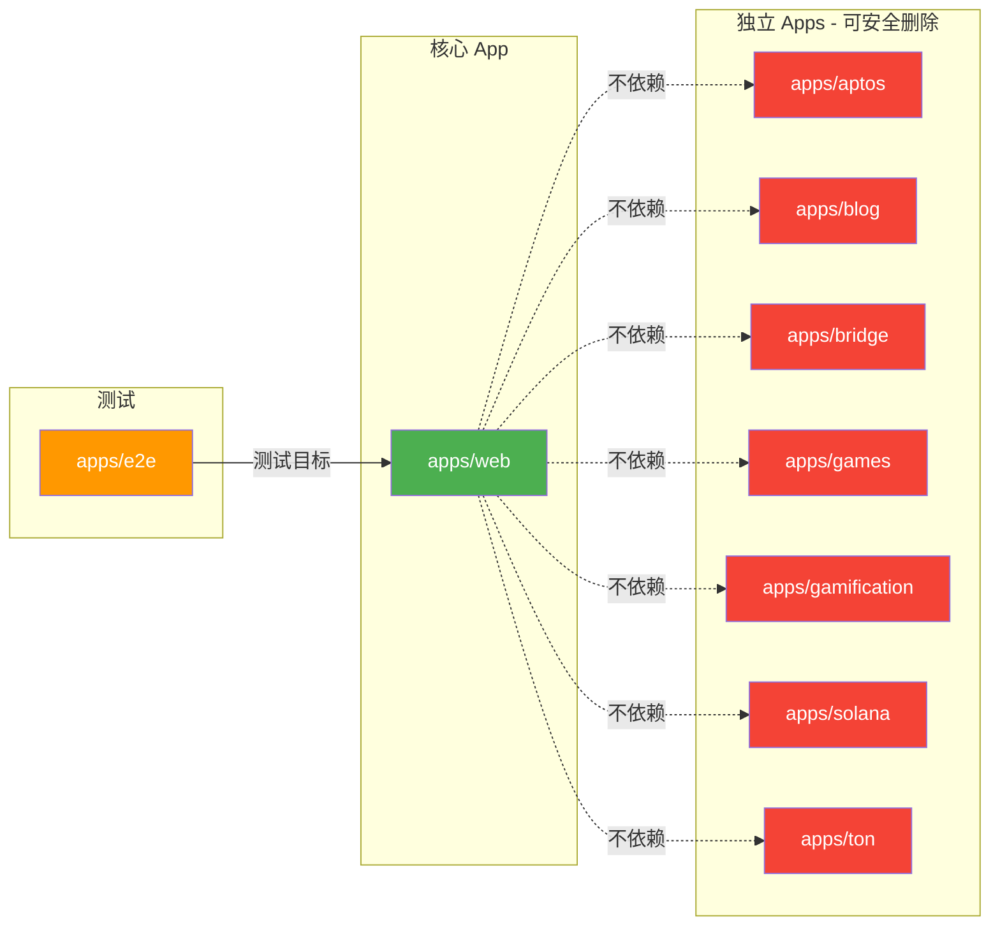

# Apps 模块移除方案

本文档分析 `apps/web` 与其他 apps 之间的依赖关系，以及安全移除不需要的 apps 的完整方案。

## 一、Apps 架构关系图

### 1.1 Apps 与共享 Packages 依赖关系

```mermaid
graph TB
    subgraph Apps["Apps 层"]
        WEB["apps/web<br/>主应用"]
        APTOS["apps/aptos<br/>Aptos 链"]
        BLOG["apps/blog<br/>博客"]
        BRIDGE["apps/bridge<br/>跨链桥"]
        E2E["apps/e2e<br/>端到端测试"]
        GAMES["apps/games<br/>游戏"]
        GAMIFICATION["apps/gamification<br/>游戏化任务"]
        SOLANA["apps/solana<br/>Solana 链"]
        TON["apps/ton<br/>TON 链"]
    end

    subgraph SharedPackages["共享 Packages"]
        UIKIT["@pancakeswap/uikit"]
        HOOKS["@pancakeswap/hooks"]
        LOCALIZATION["@pancakeswap/localization"]
        UTILS["@pancakeswap/utils"]
        CHAINS["@pancakeswap/chains"]
        TOKENS["@pancakeswap/tokens"]
        WIDGETS["@pancakeswap/widgets-internal"]
        UI_WALLETS["@pancakeswap/ui-wallets"]
        WAGMI["@pancakeswap/wagmi"]
    end

    subgraph SpecificPackages["专用 Packages"]
        AWGMI["@pancakeswap/awgmi<br/>(Aptos 钱包)"]
        APTOS_SDK["@pancakeswap/aptos-swap-sdk"]
        JUPITER["@pancakeswap/jupiter-terminal<br/>(Solana Jupiter)"]
        GAMES_PKG["@pancakeswap/games"]
        BLOG_PKG["@pancakeswap/blog"]
        PREDICTION["@pancakeswap/prediction"]
        ACHIEVEMENTS["@pancakeswap/achievements"]
    end

    %% Web 依赖
    WEB --> UIKIT
    WEB --> HOOKS
    WEB --> LOCALIZATION
    WEB --> UTILS
    WEB --> CHAINS
    WEB --> TOKENS
    WEB --> WIDGETS
    WEB --> UI_WALLETS
    WEB --> WAGMI
    WEB --> BLOG_PKG
    WEB --> PREDICTION
    WEB --> ACHIEVEMENTS

    %% Aptos 依赖
    APTOS --> AWGMI
    APTOS --> APTOS_SDK
    APTOS --> UIKIT
    APTOS --> HOOKS

    %% Blog 依赖
    BLOG --> BLOG_PKG
    BLOG --> UIKIT
    BLOG --> HOOKS

    %% Bridge 依赖
    BRIDGE --> UIKIT
    BRIDGE --> HOOKS
    BRIDGE --> CHAINS

    %% Games 依赖
    GAMES --> GAMES_PKG
    GAMES --> UIKIT
    GAMES --> BLOG_PKG

    %% Gamification 依赖
    GAMIFICATION --> ACHIEVEMENTS
    GAMIFICATION --> PREDICTION
    GAMIFICATION --> UIKIT
    GAMIFICATION --> WAGMI
    GAMIFICATION --> UI_WALLETS

    %% Solana 依赖
    SOLANA --> JUPITER
    SOLANA --> UIKIT
    SOLANA --> HOOKS

    %% TON 无特殊依赖
    TON -.-> |无 workspace 依赖| TON

    %% E2E 测试
    E2E -.-> |测试| WEB

    style WEB fill:#4CAF50,color:#fff
    style APTOS fill:#f44336,color:#fff
    style BLOG fill:#f44336,color:#fff
    style BRIDGE fill:#f44336,color:#fff
    style GAMES fill:#f44336,color:#fff
    style GAMIFICATION fill:#f44336,color:#fff
    style SOLANA fill:#f44336,color:#fff
    style TON fill:#f44336,color:#fff
    style E2E fill:#ff9800,color:#fff
```



### 1.2 Apps 之间的独立性



---

## 二、各 App 详细分析

### 2.1 apps/web（保留）

**角色**：主应用，核心业务逻辑

**依赖的 workspace packages**：
- `@pancakeswap/achievements`
- `@pancakeswap/blog`
- `@pancakeswap/canonical-bridge`
- `@pancakeswap/chains`
- `@pancakeswap/farms`
- `@pancakeswap/hooks`
- `@pancakeswap/ifos`
- `@pancakeswap/infinity-sdk`
- `@pancakeswap/localization`
- `@pancakeswap/multicall`
- `@pancakeswap/pcsx-sdk`
- `@pancakeswap/permit2-sdk`
- `@pancakeswap/pools`
- `@pancakeswap/prediction`
- `@pancakeswap/price-api-sdk`
- `@pancakeswap/routing-sdk` 系列
- `@pancakeswap/sdk`
- `@pancakeswap/smart-router`
- `@pancakeswap/solana-*` 系列
- `@pancakeswap/stable-swap-sdk`
- `@pancakeswap/swap-sdk-core`
- `@pancakeswap/token-lists`
- `@pancakeswap/tokens`
- `@pancakeswap/ui-wallets`
- `@pancakeswap/uikit`
- `@pancakeswap/universal-router-sdk`
- `@pancakeswap/utils`
- `@pancakeswap/v2-sdk`
- `@pancakeswap/v3-sdk`
- `@pancakeswap/wagmi`
- `@pancakeswap/widgets-internal`

---

### 2.2 apps/aptos（可删除）

**角色**：Aptos 链独立前端

**依赖的 workspace packages**：
- `@pancakeswap/aptos-swap-sdk` ⚠️ 专用
- `@pancakeswap/awgmi` ⚠️ 专用
- `@pancakeswap/farms`
- `@pancakeswap/hooks`
- `@pancakeswap/localization`
- `@pancakeswap/swap-sdk-core`
- `@pancakeswap/token-lists`
- `@pancakeswap/tokens`
- `@pancakeswap/ui-wallets`
- `@pancakeswap/uikit`
- `@pancakeswap/utils`
- `@pancakeswap/widgets-internal`

**被 web 依赖**：❌ 否

---

### 2.3 apps/blog（可删除）

**角色**：博客独立站点

**依赖的 workspace packages**：
- `@pancakeswap/blog`
- `@pancakeswap/hooks`
- `@pancakeswap/localization`
- `@pancakeswap/uikit`
- `@pancakeswap/utils`

**被 web 依赖**：❌ 否

---

### 2.4 apps/bridge（可删除）

**角色**：跨链桥独立站点

**依赖的 workspace packages**：
- `@pancakeswap/chains`
- `@pancakeswap/hooks`
- `@pancakeswap/localization`
- `@pancakeswap/uikit`
- `@pancakeswap/utils`

**被 web 依赖**：❌ 否

---

### 2.5 apps/games（可删除）

**角色**：游戏独立站点

**依赖的 workspace packages**：
- `@pancakeswap/blog`
- `@pancakeswap/chains`
- `@pancakeswap/games` ⚠️ 专用
- `@pancakeswap/hooks`
- `@pancakeswap/localization`
- `@pancakeswap/uikit`
- `@pancakeswap/utils`

**被 web 依赖**：❌ 否

---

### 2.6 apps/gamification（可删除）

**角色**：游戏化任务系统

**依赖的 workspace packages**：
- `@pancakeswap/achievements`
- `@pancakeswap/chains`
- `@pancakeswap/hooks`
- `@pancakeswap/ifos`
- `@pancakeswap/localization`
- `@pancakeswap/multicall`
- `@pancakeswap/prediction`
- `@pancakeswap/sdk`
- `@pancakeswap/smart-router`
- `@pancakeswap/swap-sdk-core`
- `@pancakeswap/tokens`
- `@pancakeswap/ui-wallets`
- `@pancakeswap/uikit`
- `@pancakeswap/utils`
- `@pancakeswap/wagmi`
- `@pancakeswap/v3-sdk`
- `@pancakeswap/widgets-internal`

**被 web 依赖**：❌ 否

---

### 2.7 apps/solana（可删除）

**角色**：Solana 链独立前端

**依赖的 workspace packages**：
- `@pancakeswap/hooks`
- `@pancakeswap/jupiter-terminal` ⚠️ 专用
- `@pancakeswap/localization`
- `@pancakeswap/solana-clmm-sdk`
- `@pancakeswap/solana-core-sdk`
- `@pancakeswap/uikit`
- `@pancakeswap/utils`
- `@pancakeswap/widgets-internal`

**被 web 依赖**：❌ 否

---

### 2.8 apps/ton（可删除）

**角色**：TON 链独立前端（空项目）

**依赖的 workspace packages**：无

**被 web 依赖**：❌ 否

---

### 2.9 apps/e2e（建议保留）

**角色**：端到端测试

**说明**：用于测试 web 应用，如果删除 web 以外的 apps，e2e 仍然有用。

---

## 三、Packages 移除分析

### 3.1 可安全移除的 Packages

以下 packages 仅被要删除的 apps 使用，不被 `apps/web` 依赖：

| Package | 使用者 | 移除影响 |
|---------|--------|----------|
| `packages/games` | apps/games | 游戏数据配置不可用 |
| `packages/awgmi` | apps/aptos | Aptos 钱包连接不可用 |
| `packages/aptos-swap-sdk` | apps/aptos | Aptos swap 功能不可用 |
| `packages/jupiter-terminal` | apps/solana | Jupiter 聚合器不可用 |

### 3.2 不能移除的 Packages

以下 packages 被 `apps/web` 直接依赖：

| Package | web 引用文件数 |
|---------|---------------|
| `@pancakeswap/achievements` | 7 个文件 |
| `@pancakeswap/blog` | 1 个文件 |
| `@pancakeswap/prediction` | 69+ 个文件 |

---

## 四、移除步骤

### 步骤 1：删除 Apps

```bash
# 删除不需要的 apps
rm -rf apps/aptos
rm -rf apps/blog
rm -rf apps/bridge
rm -rf apps/games
rm -rf apps/gamification
rm -rf apps/solana
rm -rf apps/ton
```

### 步骤 2：删除专用 Packages（可选）

```bash
# 删除仅被已删除 apps 使用的 packages
rm -rf packages/games
rm -rf packages/awgmi
rm -rf packages/aptos-swap-sdk
rm -rf packages/jupiter-terminal
```

### 步骤 3：清理 CI/CD 配置

检查并移除 `.github/workflows/` 中相关的部署配置：

```bash
# 查看相关 workflow 文件
ls -la .github/workflows/
```

需要检查的文件：
- `deploy-apis.yml`
- 其他可能包含 aptos、blog、bridge、games、gamification、solana、ton 的 workflow

### 步骤 4：更新依赖

```bash
# 重新安装依赖，清理 lockfile
pnpm install

# 验证 web 构建
pnpm --filter web build
```

---

## 五、验证清单

- [ ] 删除 apps 目录
- [ ] 删除专用 packages（可选）
- [ ] 清理 CI/CD 配置
- [ ] 运行 `pnpm install`
- [ ] 运行 `pnpm --filter web build` 验证构建
- [ ] 运行 `pnpm --filter web dev` 验证开发环境
- [ ] 检查是否有遗留的 import 错误

---

## 六、回滚方案

如果需要恢复，可以通过 git 恢复：

```bash
# 恢复所有删除的文件
git checkout HEAD -- apps/aptos apps/blog apps/bridge apps/games apps/gamification apps/solana apps/ton

# 恢复 packages（如果删除了）
git checkout HEAD -- packages/games packages/awgmi packages/aptos-swap-sdk packages/jupiter-terminal

# 重新安装依赖
pnpm install
```

---

## 七、总结

| 操作 | 影响 | 风险 |
|------|------|------|
| 删除 apps/aptos | Aptos 链功能不可用 | 低 |
| 删除 apps/blog | 博客站点不可用 | 低 |
| 删除 apps/bridge | 跨链桥站点不可用 | 低 |
| 删除 apps/games | 游戏站点不可用 | 低 |
| 删除 apps/gamification | 任务系统不可用 | 低 |
| 删除 apps/solana | Solana 链功能不可用 | 低 |
| 删除 apps/ton | TON 链功能不可用 | 低 |
| 删除 packages/games | 无影响（web 不使用） | 无 |
| 删除 packages/awgmi | 无影响（web 不使用） | 无 |
| 删除 packages/aptos-swap-sdk | 无影响（web 不使用） | 无 |
| 删除 packages/jupiter-terminal | 无影响（web 不使用） | 无 |

**结论**：所有列出的 apps 都是独立的，可以安全删除而不影响 `apps/web` 的正常构建和运行。
