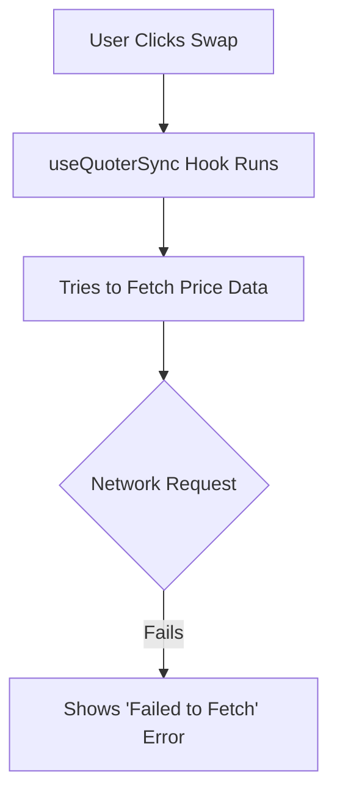

# Understanding the "Failed to Fetch" Error in Swap Feature

## The Error in Simple Terms

Imagine you're trying to buy something from a vending machine, but when you press the button, nothing happens - that's similar to the "Failed to fetch" error in the swap feature. The system tried to get some important information it needed, but the request didn't work.

## What's Happening (Like I'm 5)

1. **The Vending Machine Analogy**
   - You (the user) want to swap one cryptocurrency for another
   - The app (vending machine) tries to get the latest prices and trading info
   - But the connection to get that info failed (like if the vending machine couldn't connect to the bank)

2. **The Technical Flow**

## Common Causes

1. **Internet Connection Issues**
   - Your internet might be unstable
   - The server might be temporarily down

2. **Wallet Connection Problems**
   - Your wallet (like MetaMask) might not be properly connected
   - The network might have switched unexpectedly

3. **Server-Side Issues**
   - The price API might be down
   - There could be too many people using the service

## How to Fix It

1. **Basic Checks**
   - 🔄 Refresh the page
   - 🌐 Check your internet connection
   - 🔌 Make sure your wallet is connected

2. **Advanced Checks**
   - Switch networks and switch back
   - Clear your browser cache
   - Try using a different browser

## Technical Deep Dive

The error occurs in this sequence:
1. `useQuoterSync` hook tries to fetch price data
2. The request fails at the network level
3. The error bubbles up through the React component tree
4. The UI shows the generic "Failed to fetch" message

## Prevention

The app could be improved by:
1. Better error messages
2. Automatic retries for failed requests
3. Fallback data sources
4. Clearer user instructions when errors occur

Remember: This is usually a temporary issue that can be fixed with a simple page refresh or by checking your internet connection!
