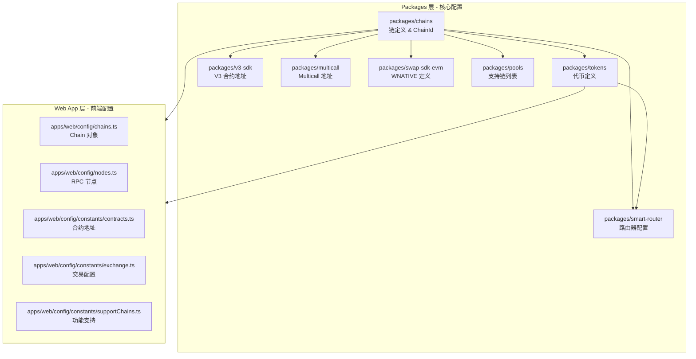

# SimpleChain Testnet 配置报告

## 概述

本报告记录了为 SimpleFlow (PancakeSwap V3 Fork) 在 SimpleChain Testnet 上的完整前端配置。

- **Chain ID**: 1914
- **链类型**: EVM 兼容链 (BSC Fork)
- **网络类型**: Testnet
- **支持功能**: V3 Only (无 V2, 无 StableSwap)
- **API/Subgraph**: 禁用

---

## 配置架构



---

## 合约地址汇总

| 合约 | 地址 |
|------|------|
| **WSRW (Wrapped Native)** | `0x22608aC253B934D5078cB0d12f7F7e377b51798b` |
| **Factory** | `0xac3695E50cDc22941cffcBBE817EF2c7d7ef4AA5` |
| **Pool Deployer** | `0x9E04B69a17f4Ce1AC05600EF3bEf66eF423E455d` |
| **NFT Position Manager** | `0x53074FeB375dD50b600c9986180ab90974112284` |
| **Smart Router** | `0xC4E1763C9F2fa88406f5d8aba0a6d30dfC5F8E12` |
| **Quoter V2** | `0xA88cE47B8e9eF10591Be79793ccBA2C9d04866c5` |
| **Tick Lens** | `0x64272699d818646781a4fCAa435C98A05b2d9668` |
| **Multicall3** | `0xcA11bde05977b3631167028862bE2a173976CA11` |
| **INIT_CODE_HASH** | `0x2485b4b8c1eb9eba7259fb706aa57ea101810c610dec7a2c4ec0c47cbc2e9395` |

---

## 代币列表

| 代币 | 符号 | 精度 | 合约地址 |
|------|------|------|----------|
| Wrapped SRW | WSRW | 18 | `0x22608aC253B934D5078cB0d12f7F7e377b51798b` |
| Wrapped Bitcoin | WBTC | 8 | `0x770556F853a17893b1187A9754F17c6f57776b7c` |
| Tether USD | USDT | 6 | `0x3577E5E0E3A47d9a552426638977ee3EddD4552e` |
| USD Coin | USDC | 6 | `0xf373DeaAc4a65d92c6543C4ad879bebA55ef9769` |
| Dai Stablecoin | DAI | 18 | `0xA16171a7dadfb86afC934eaF16daCD86cD435120` |
| SimpleDex Token | SDX | 18 | `0x961245FCe30FC5a3C7F4ee8AFa05f85cF5AB8C75` |
| Wrapped Solana | WSOL | 18 | `0xbB0543b26A291648D67B91a8A0f150f6122FEd03` |

---

## 修改文件详情

### 1. packages/chains

#### `packages/chains/src/chainId.ts`
```typescript
// 添加 ChainId 枚举
export enum ChainId {
  // ... 其他链
  SIMPLECHAIN_TESTNET = 1914,
}

// 添加到 testnet 列表
export const testnetChainIds = [
  // ... 其他链
  ChainId.SIMPLECHAIN_TESTNET,
]
```

#### `packages/chains/src/chainNames.ts`
```typescript
// chainNames 映射
[ChainId.SIMPLECHAIN_TESTNET]: 'simplechainTestnet'

// chainFullNames 映射
[ChainId.SIMPLECHAIN_TESTNET]: 'SimpleChain Testnet'

// chainNamesInKebabCase 映射
[ChainId.SIMPLECHAIN_TESTNET]: 'simplechain-testnet'

// mainnetChainNamesInKebabCase 映射
[ChainId.SIMPLECHAIN_TESTNET]: 'simplechain'

// defiLlamaChainNames 映射 (空字符串，无 DeFiLlama 支持)
[ChainId.SIMPLECHAIN_TESTNET]: ''
```

#### `packages/chains/src/chains.ts`
```typescript
{
  id: ChainId.SIMPLECHAIN_TESTNET,
  name: chainNames[ChainId.SIMPLECHAIN_TESTNET],
  fullName: chainFullNames[ChainId.SIMPLECHAIN_TESTNET],
  isEVM: true,
  testnet: true,
}
```

#### `packages/chains/src/subgraphs.ts`
```typescript
// V3 Subgraph (禁用)
[ChainId.SIMPLECHAIN_TESTNET]: null
```

#### `packages/chains/src/averageChainBlockTimes.ts`
```typescript
[ChainId.SIMPLECHAIN_TESTNET]: 3  // 3 秒区块时间
```

---

### 2. packages/tokens

#### `packages/tokens/src/constants/simplechainTestnet.ts` (新文件)
```typescript
import { ERC20Token } from '@pancakeswap/sdk'
import { ChainId } from '@pancakeswap/chains'

export const simplechainTestnetTokens = {
  wsrw: new ERC20Token(
    ChainId.SIMPLECHAIN_TESTNET,
    '0x22608aC253B934D5078cB0d12f7F7e377b51798b',
    18,
    'WSRW',
    'Wrapped SRW',
  ),
  wbtc: new ERC20Token(
    ChainId.SIMPLECHAIN_TESTNET,
    '0x770556F853a17893b1187A9754F17c6f57776b7c',
    8,
    'WBTC',
    'Wrapped Bitcoin',
  ),
  usdt: new ERC20Token(
    ChainId.SIMPLECHAIN_TESTNET,
    '0x3577E5E0E3A47d9a552426638977ee3EddD4552e',
    6,
    'USDT',
    'Tether USD',
  ),
  usdc: new ERC20Token(
    ChainId.SIMPLECHAIN_TESTNET,
    '0xf373DeaAc4a65d92c6543C4ad879bebA55ef9769',
    6,
    'USDC',
    'USD Coin',
  ),
  dai: new ERC20Token(
    ChainId.SIMPLECHAIN_TESTNET,
    '0xA16171a7dadfb86afC934eaF16daCD86cD435120',
    18,
    'DAI',
    'Dai Stablecoin',
  ),
  sdx: new ERC20Token(
    ChainId.SIMPLECHAIN_TESTNET,
    '0x961245FCe30FC5a3C7F4ee8AFa05f85cF5AB8C75',
    18,
    'SDX',
    'SimpleDex Token',
  ),
  wsol: new ERC20Token(
    ChainId.SIMPLECHAIN_TESTNET,
    '0xbB0543b26A291648D67B91a8A0f150f6122FEd03',
    18,
    'WSOL',
    'Wrapped Solana',
  ),
}
```

#### `packages/tokens/src/index.ts`
```typescript
export * from './constants/simplechainTestnet'
```

#### `packages/tokens/src/allTokens.ts`
```typescript
import { simplechainTestnetTokens } from './constants/simplechainTestnet'

// 在 allTokens 对象中添加
[ChainId.SIMPLECHAIN_TESTNET]: simplechainTestnetTokens
```

---

### 3. packages/v3-sdk

#### `packages/v3-sdk/src/constants.ts`
```typescript
// Factory 地址
FACTORY_ADDRESSES: {
  [ChainId.SIMPLECHAIN_TESTNET]: '0xac3695E50cDc22941cffcBBE817EF2c7d7ef4AA5'
}

// Deployer 地址
DEPLOYER_ADDRESSES: {
  [ChainId.SIMPLECHAIN_TESTNET]: '0x9E04B69a17f4Ce1AC05600EF3bEf66eF423E455d'
}

// Pool Init Code Hash
POOL_INIT_CODE_HASHES: {
  [ChainId.SIMPLECHAIN_TESTNET]: '0x2485b4b8c1eb9eba7259fb706aa57ea101810c610dec7a2c4ec0c47cbc2e9395'
}

// NFT Position Manager 地址
NFT_POSITION_MANAGER_ADDRESSES: {
  [ChainId.SIMPLECHAIN_TESTNET]: '0x53074FeB375dD50b600c9986180ab90974112284'
}
```

---

### 4. packages/smart-router

#### `packages/smart-router/evm/constants/v3.ts`
```typescript
// Mixed Route Quoter (复用 Quoter 地址)
MIXED_ROUTE_QUOTER_ADDRESSES: {
  [ChainId.SIMPLECHAIN_TESTNET]: '0xA88cE47B8e9eF10591Be79793ccBA2C9d04866c5'
}

// V3 Quoter 地址
V3_QUOTER_ADDRESSES: {
  [ChainId.SIMPLECHAIN_TESTNET]: '0xA88cE47B8e9eF10591Be79793ccBA2C9d04866c5'
}

// Tick Lens 地址
V3_TICK_LENS_ADDRESSES: {
  [ChainId.SIMPLECHAIN_TESTNET]: '0x64272699d818646781a4fCAa435C98A05b2d9668'
}
```

#### `packages/smart-router/evm/constants/exchange.ts`
```typescript
// Smart Router 地址
SMART_ROUTER_ADDRESSES: {
  [ChainId.SIMPLECHAIN_TESTNET]: '0xC4E1763C9F2fa88406f5d8aba0a6d30dfC5F8E12'
}

// V2 Router (空，不支持 V2)
V2_ROUTER_ADDRESS: {
  [ChainId.SIMPLECHAIN_TESTNET]: ''
}

// StableSwap Info (空，不支持)
STABLE_SWAP_INFO_ADDRESS: {
  [ChainId.SIMPLECHAIN_TESTNET]: ''
}

// 交易基础代币
BASES_TO_CHECK_TRADES_AGAINST: {
  [ChainId.SIMPLECHAIN_TESTNET]: [
    simplechainTestnetTokens.wsrw,
    simplechainTestnetTokens.usdc,
    simplechainTestnetTokens.usdt
  ]
}
```

---

### 5. packages/multicall

#### `packages/multicall/src/constants/contracts.ts`
```typescript
// Multicall 地址
MULTICALL_ADDRESS: {
  [ChainId.SIMPLECHAIN_TESTNET]: '0xcA11bde05977b3631167028862bE2a173976CA11'
}

// Multicall3 地址
MULTICALL3_ADDRESSES: {
  [ChainId.SIMPLECHAIN_TESTNET]: MULTICALL3_ADDRESS  // 0xcA11bde05977b3631167028862bE2a173976CA11
}
```

---

### 6. packages/swap-sdk-evm

#### `packages/swap-sdk-evm/src/constants.ts`
```typescript
// WSRW Token 定义 (放在 WETH9 对象中作为 wrapped native)
WETH9: {
  [ChainId.SIMPLECHAIN_TESTNET]: new ERC20Token(
    ChainId.SIMPLECHAIN_TESTNET,
    '0x22608aC253B934D5078cB0d12f7F7e377b51798b',
    18,
    'WSRW',
    'Wrapped SRW',
  )
}

// WNATIVE 映射
WNATIVE: {
  [ChainId.SIMPLECHAIN_TESTNET]: WETH9[ChainId.SIMPLECHAIN_TESTNET]
}

// Native Token 信息
NATIVE: {
  [ChainId.SIMPLECHAIN_TESTNET]: {
    name: 'SimpleChain',
    symbol: 'SRW',
    decimals: 18,
  }
}
```

---

### 7. packages/pools

#### `packages/pools/src/constants/supportedChains.ts`
```typescript
export const SUPPORTED_CHAIN_IDS = [
  // ... 其他链
  ChainId.SIMPLECHAIN_TESTNET,
]
```

---

### 8. apps/web/src/config

#### `apps/web/src/config/chains.ts`
```typescript
const simplechainTestnet: Chain = {
  id: ChainId.SIMPLECHAIN_TESTNET,
  name: 'SimpleChain Testnet',
  nativeCurrency: { name: 'SRW', symbol: 'SRW', decimals: 18 },
  rpcUrls: {
    default: { http: ['https://testnet-rpc.simplechain.co'] },
    public: { http: ['https://testnet-rpc.simplechain.co'] },
  },
  blockExplorers: {
    default: {
      name: 'SimpleChain Explorer',
      url: 'https://testnet-explorer.simplechain.com',
    },
  },
  contracts: {
    multicall3: {
      address: '0xcA11bde05977b3631167028862bE2a173976CA11',
    },
  },
  testnet: true,
}

// 添加到 CHAINS 数组 (不添加到 L2_CHAIN_IDS)
export const CHAINS: [Chain, ...Chain[]] = [
  // ... 其他链
  simplechainTestnet,
]
```

#### `apps/web/src/config/nodes.ts`
```typescript
// SERVER_NODES
[ChainId.SIMPLECHAIN_TESTNET]: ['https://testnet-rpc.simplechain.co']

// PUBLIC_NODES
[ChainId.SIMPLECHAIN_TESTNET]: ['https://testnet-rpc.simplechain.co']
```

---

### 9. apps/web/src/config/constants

#### `apps/web/src/config/constants/contracts.ts`
```typescript
multiCall: {
  [ChainId.SIMPLECHAIN_TESTNET]: '0xcA11bde05977b3631167028862bE2a173976CA11'
}
```

#### `apps/web/src/config/constants/exchange.ts`
```typescript
// 刷新时间
CHAIN_REFRESH_TIME: {
  [ChainId.SIMPLECHAIN_TESTNET]: 6_000  // 6 秒
}

// 建议基础代币
SUGGESTED_BASES: {
  [ChainId.SIMPLECHAIN_TESTNET]: [
    simplechainTestnetTokens.wsrw,
    simplechainTestnetTokens.usdc,
    simplechainTestnetTokens.usdt
  ]
}

// 流动性追踪基础代币
BASES_TO_TRACK_LIQUIDITY_FOR: {
  [ChainId.SIMPLECHAIN_TESTNET]: [
    simplechainTestnetTokens.wsrw,
    simplechainTestnetTokens.usdc,
    simplechainTestnetTokens.usdt
  ]
}

// 固定交易对
PINNED_PAIRS: {
  [ChainId.SIMPLECHAIN_TESTNET]: [
    [simplechainTestnetTokens.wsrw, simplechainTestnetTokens.usdc],
    [simplechainTestnetTokens.wsrw, simplechainTestnetTokens.usdt],
  ]
}
```

#### `apps/web/src/config/constants/supportChains.ts`
```typescript
// 价格图表不支持 (因为无 Subgraph)
export const SWAP_CHART_UNSUPPORTED_CHAINS = [
  ChainId.MONAD_MAINNET,
  ChainId.MONAD_TESTNET,
  ChainId.SIMPLECHAIN_TESTNET
]
```

---

### 10. 其他配置文件

#### `apps/web/src/components/NetworkSwitcher.tsx`
```typescript
SHORT_SYMBOL: {
  [ChainId.SIMPLECHAIN_TESTNET]: 'tSimple'
}
```

#### `apps/web/src/quoter/consts.ts`
```typescript
// Quote 超时时间
QUOTE_TIMEOUT: {
  [ChainId.SIMPLECHAIN_TESTNET]: 12_000
}

// 成功后重验证间隔
QUOTE_SUCC_REVALIDATE: {
  [ChainId.SIMPLECHAIN_TESTNET]: 15
}

// 失败后重验证间隔
QUOTE_FAIL_REVALIDATE: {
  [ChainId.SIMPLECHAIN_TESTNET]: 5
}
```

#### `apps/web/src/config/pools.ts`
```typescript
// 快速重验证间隔
POOLS_FAST_REVALIDATE: {
  [ChainId.SIMPLECHAIN_TESTNET]: 10_000
}

// 慢速重验证间隔
POOLS_SLOW_REVALIDATE: {
  [ChainId.SIMPLECHAIN_TESTNET]: 20_000
}
```

---

## 网络配置

| 配置项 | 值 |
|--------|-----|
| **Chain ID** | 1914 |
| **网络名称** | SimpleChain Testnet |
| **原生代币** | SRW |
| **原生代币精度** | 18 |
| **RPC URL** | https://testnet-rpc.simplechain.co |
| **区块浏览器** | https://testnet-explorer.simplechain.com |
| **平均区块时间** | 3 秒 |
| **是否 L2** | 否 |
| **是否 Testnet** | 是 |

---

## 功能支持状态

| 功能 | 状态 |
|------|------|
| V3 Swap | ✅ 支持 |
| V3 Liquidity | ✅ 支持 |
| V2 Swap | ❌ 不支持 |
| V2 Liquidity | ❌ 不支持 |
| StableSwap | ❌ 不支持 |
| Farms | ❌ 不支持 |
| Price Chart | ❌ 不支持 (无 Subgraph) |
| Info Page | ❌ 不支持 (无 Subgraph) |
| Token List API | ❌ 不支持 |
| Liquid Staking | ❌ 不支持 |
| TWAP/Limit Orders | ❌ 不支持 |

---

## 后续步骤

1. **运行构建验证**
   ```bash
   pnpm build
   ```

2. **添加链图标**
   - 需要在 ASSET_CDN 添加 `chains/1914.png` 图标

3. **启动本地开发**
   ```bash
   pnpm dev:web
   ```

4. **测试功能**
   - 切换网络到 SimpleChain Testnet
   - 测试 V3 Swap 功能
   - 测试添加/移除流动性

---

## 文件修改清单

| 文件路径 | 修改类型 |
|----------|----------|
| `packages/chains/src/chainId.ts` | 修改 |
| `packages/chains/src/chainNames.ts` | 修改 |
| `packages/chains/src/chains.ts` | 修改 |
| `packages/chains/src/subgraphs.ts` | 修改 |
| `packages/chains/src/averageChainBlockTimes.ts` | 修改 |
| `packages/tokens/src/constants/simplechainTestnet.ts` | **新建** |
| `packages/tokens/src/index.ts` | 修改 |
| `packages/tokens/src/allTokens.ts` | 修改 |
| `packages/v3-sdk/src/constants.ts` | 修改 |
| `packages/smart-router/evm/constants/v3.ts` | 修改 |
| `packages/smart-router/evm/constants/exchange.ts` | 修改 |
| `packages/multicall/src/constants/contracts.ts` | 修改 |
| `packages/swap-sdk-evm/src/constants.ts` | 修改 |
| `packages/pools/src/constants/supportedChains.ts` | 修改 |
| `apps/web/src/config/chains.ts` | 修改 |
| `apps/web/src/config/nodes.ts` | 修改 |
| `apps/web/src/config/constants/contracts.ts` | 修改 |
| `apps/web/src/config/constants/exchange.ts` | 修改 |
| `apps/web/src/config/constants/supportChains.ts` | 修改 |
| `apps/web/src/config/pools.ts` | 修改 |
| `apps/web/src/components/NetworkSwitcher.tsx` | 修改 |
| `apps/web/src/quoter/consts.ts` | 修改 |

**总计: 22 个文件修改, 1 个新建文件**

---

*报告生成时间: 2025-12-22*


